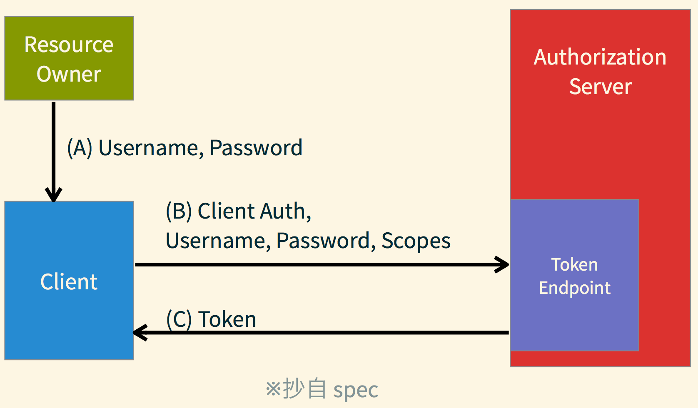

###此篇用來記錄看鴨七大所整理出來OAuth2的筆記

[鴨大's Blog](https://blog.yorkxin.org/)

以及鴨七大在2013/11/26, Ruby Tuesday Taipei #27，所分享的[投影片](https://speakerdeck.com/chitsaou/jian-dan-yi-dong-de-oauth-2-dot-0)

===

OAuth 2.0的角色

1. Authorization Server: 管理授權的一切服務
2. Client(App): 存取User的應用程式
3. Resource Owner: 資料的所有者(User)
4. Resource Server: 存放資料的服務端，Client可經由API的方式來存取資料

就像User有FB的帳號，FB上也有很多User相關的資料，像是貼文(posts)、基本資料(profile)、照片(photos)、好友(friends)…等

當User去使用一個App，而App希望User可以授權存取FB上的資料

則App會請User到FB換取授權憑證，App取得憑證後，就能到FB存放資料的Resource Server，索取User所授權的FB上相關資料

===

Client需事先向Auth.Server註冊取得認證資料，像是Client ID, Client Secret，還有設定Redirect URL

Redirect URL是用來確保轉址到正確的client；當User授權後的資料要送往何處，如與原先設定的不同，則不可進行轉送結果

===

依是否能**保護資料**來定義以下的詞

Confidentail: Server Side Application

Public: 手機App, Desktop App, JavaScript App, Browser Extension

===

Authorization Endpoint(https): 用來讓User確認授權，在此User會取得Grant(授權狀)(自我轉譯，也許是像"代理證明")

Token Endpoint: 用來讓Client(需驗證SSL)取得真正的Token；JSON API，無網頁

Redirection Endpoint: Client收資料的地方，接收Auth. Server回傳的資料

Resource Server:

可使用Scope限制Token存取資料的部份

===

Token(s):

* Access Token: 是用來向Resource Server索取資料，能綁上Scope，以及設定效期，過效期就失效(Revoke)

* Refresh Token: 用來用Auth. Server換發Access Token，是與Access Token一起給予，用過就會失效；與Access Token是一對一的關係

Scope: 用來表示「可以存取哪些資料」的權限範圍

State: 用來防止CSRF攻擊，因為Client經由Browser到Auth. Server是很危險的

===

以Client的視角來說明取得授權的流程

    1. Client向Res. Owner(User)取得Grant
    1. Client用Grant向Auth. Server換Token
    1. 拿Token去向Res. Server取資料

===

以下截圖出至鴨七大的ppt

Auth. Code Grant Flow: 驗證後給予grant，並拿grant換取token和refresh token

Implicit Grant Flow: 直接發token，但效期短，並不會給refresh token

Resource Owner Password Credentials Grant Flow: 需要是Resource Owner高度信賴Client(官方App)

Client Credentials Grant Flow:

===

Errors on Authorization Endpoint:

* 無法識別Client、Redirect URL不符
    1. Redirect URL 沒給/不正確/沒事先註冊
    2. 視為攻擊，不可回傳到Redirect URL
    3. 要跟Res. Owner提報警訊

* 參數錯誤、Auth. Server沒實作的功能、Res. Owner拒絕授權、Internal Server Error
    1. 需轉回Redirect URL的Client告知錯誤
    2. 在URI後加上error parameters
        * Auth Code Grant Flow - 用 Query ?error=...
        * Implicit Grant Flow - 用 Fragment #error=...

    Error Parameters:

    1. error - Error Code ，必填，下詳
    1. error_description - 簡單說明錯誤
    1. error_uri - 一個網址指到詳細說明網頁
    1. state - 傳回 Client 的 state 原值，之前有給就必填

Errors on Token Endpoint:

1. Auth. Server 認不得 Client
2. 參數傳錯 / Authorization Server 沒實作某些功能
3. 授權狀 (Grant) 不正確
4. Internal Server Error

===

出示Token的方式:

1. in Header (最推薦)
1. in Body
1. in URL (不推薦)

