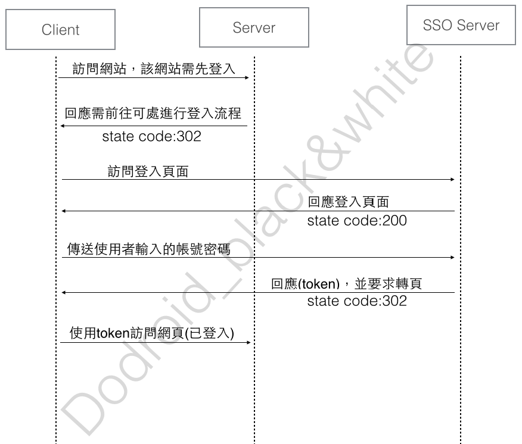

把自己小小的理解SSO的流程記錄下來

恩…SSO…也就是Single Sign On的縮寫

然而什麼是SSO？

簡單的說，就是使用者登入後，會得到一組可以存取資料的金鑰(token)

在token有效期內，可以用來跟server存取資料。

下圖是經由Rick大的講解，以及自己消化後整理出來的圖

至於…server該怎麼去驗證token的正確性…

這又是另一個故事了 ( ？

接下來要研究的是OAuth2.0

要來去拜讀鴨七大的大作了